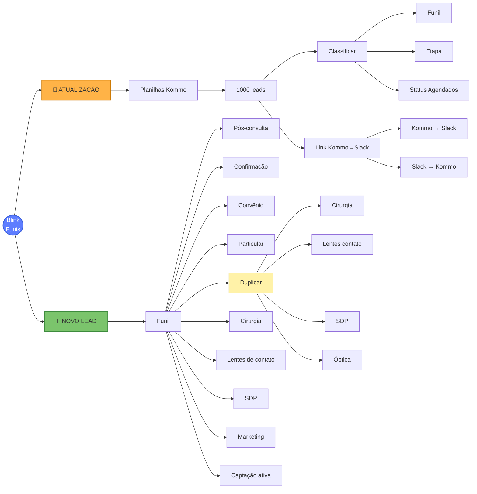

# 🗺 Mapa de Arquitetura dos Funis Blink

> Migrado do Freeplane. Edita aqui em texto, abre em mind map com plugin Markmap.
> Navegação: [[00-INDEX]] · [[MAPA_OPORTUNIDADES_LEADS_FRIO]] · [[CLAUDE]]

---

## 1. Estrutura nested (texto editável)

- **Blink — Arquitetura de Funis**
  - **🔄 ATUALIZAÇÃO** (manutenção contínua da base)
    - **Planilhas Kommo**
      - **1000 leads** (lote de processamento por ciclo)
        - **Classificar**
          - Funil
          - Etapa
          - Status agendados
        - **Link Kommo ↔ Slack**
          - Kommo → Slack
          - Slack → Kommo
  - **➕ NOVO LEAD** (entrada/captação)
    - **Funil**
      - Pós-consulta
      - Confirmação
      - Convênio
      - Particular
      - **Duplicar** (lead com múltiplos serviços)
        - Cirurgia
        - Lentes de contato
        - SDP (Strabismo / Diabetes / Pterígio)
        - Óptica
      - Cirurgia
      - Lentes de contato
      - SDP
      - Marketing
      - Captação ativa

---

## 2. Diagrama Mermaid (renderiza nativo no Obsidian)

> Mermaid é renderizado nativamente pelo Obsidian Live Preview. Não precisa
> instalar plugin. Edita o bloco abaixo e o gráfico atualiza ao vivo.



---

## 3. Tabelas operacionais por ramo

### 🔄 Ramo ATUALIZAÇÃO

| Componente | O que faz | Periodicidade | Onde está |
|---|---|---|---|
| Planilhas Kommo (1000 leads) | Lote pra classificar manualmente | Ad hoc, sob demanda | Drive/Sheets |
| Classificar (Funil/Etapa/Status) | Define para qual pipeline o lead vai | A cada lote | Kommo direto |
| Link Kommo→Slack | Notifica time de novo lead | Tempo real | Webhook Kommo |
| Link Slack→Kommo | Atualiza Kommo a partir de comandos Slack | Sob demanda | MCP `mcp__obsidian__*` (ou bot) |

### ➕ Ramo NOVO LEAD — segmentação por funil

| Subfunil | Quando entra aqui | Template recomendado | Médico padrão |
|---|---|---|---|
| Pós-consulta | Lead pós-consulta realizada | `blink_pos_avaliacao_*_v1` | Karla / Fabrício |
| Confirmação | Lead com consulta marcada (D-1) | `blink_conf_d1_v1` | qualquer |
| Convênio | Lead com convênio declarado | `blink_lf_a_convenio_aceito_v1` | qualquer |
| Particular | Lead sem convênio | `blink_lf_b_particular_v1` | qualquer |
| Duplicar | Lead com 2+ serviços (multi-board) | N/A — gerar 1 lead por serviço | varia |
| Cirurgia | Cirurgias de catarata | `blink_lf_f_catarata_v1` | Fabrício |
| Lentes de contato | Adaptação LC | (sem template específico) | Karla |
| SDP | Strabismo / Diabetes / Pterígio | (Karla — Asa Norte) | Karla |
| Marketing | Veio de campanha Meta/Google | usar `FONTE_CAPTACAO` field | qualquer |
| Captação ativa | Outbound do time | manual | varia |

### Subramo "Duplicar"

Quando o lead manifesta interesse em **mais de um** serviço (ex.: catarata + óptica), criar **1 lead por serviço** com mesmo contato vinculado. Isso evita misturar conversas em pipelines diferentes.

| Serviço | Pipeline destino | Médico responsável |
|---|---|---|
| Cirurgia | ATENDE 8601819 | Fabrício |
| Lentes de contato | ATENDE 8601819 | Karla |
| SDP | ATENDE 8601819 | Karla (Asa Norte) |
| Óptica | (pipeline separado, se houver) | — |

---

## 4. Como abrir como mind map no Obsidian

### Opção 1 — Plugin **Markmap** (visual idêntico ao Freeplane)

1. Settings → Community plugins → Browse → **Markmap**.
2. Install + Enable.
3. Abra este arquivo.
4. Cmd+P → "Markmap: Open as Markmap" → renderiza a seção 1 como mind map interativo.

### Opção 2 — Plugin **Mind Map** (Enhancing Mindmap)

Funciona igual. Settings → plugins → "Enhancing Mindmap" → Install.

### Opção 3 — Mermaid (já funciona, sem plugin)

A seção 2 (bloco ` ```mermaid `) já renderiza com o Obsidian Live Preview ativado por padrão. Cmd+E pra alternar editor/preview.

---

## 5. Sincronização com Freeplane (opcional)

Se quiser manter os dois em paralelo:

1. No Freeplane: **File → Export → Markdown (.md)** → cola o resultado na seção 1.
2. No Obsidian: edita a seção 1 → **File → Import → Markdown** no Freeplane.

⚠️ Conflitos: edição em paralelo não tem merge automático. Recomendado escolher 1 ferramenta como **fonte da verdade** (sugestão: Obsidian).

---

## 6. Próximas evoluções do mapa

- [ ] Adicionar coluna "volume real" em cada ramo (puxar de Kommo via Dataview + endpoint /admin/audit)
- [ ] Marcar qual médico atende qual ramo (Karla vs Fabrício vs Kátia)
- [ ] Linkar cada categoria do funil ao template Meta correspondente (após aprovação)
- [ ] Adicionar ramo SAÍDA: closed-won, closed-lost, no-show com taxa de conversão
- [ ] Criar página `/admin/audit/funis-resumo` que devolve volume real por ramo (auto-update do mapa via Dataview)
